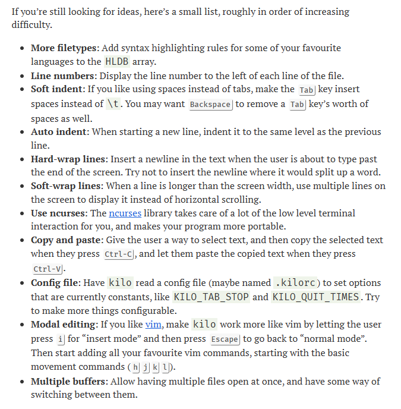

# C-TextEditor
A Text Editor in C

Following [this blog](https://viewsourcecode.org/snaptoken/kilo/)

At this stage, the blog implementation is complete with these key features.

- Save as new file / edit existing file
- Syntax highlighting
- Search

Next step, to implement at least one of the suggested features on my own



### Features added so far

- [x] Display line numbers on the left of the line


### To run this project

```bash
git clone https://github.com/OmKharade/C-TextEditor.git

cd C-TextEditor

make

# Open text editor with an empty file
./texty

# Open text editor with an existing file
./texty <filename>
```


> The original source code can be found [here](https://github.com/snaptoken/kilo-src)